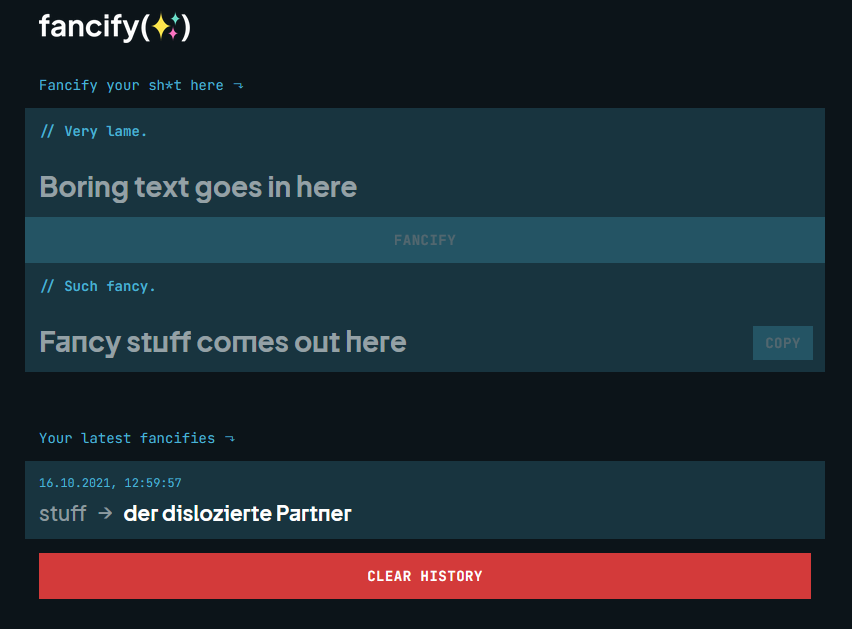

# fancify :sparkles:

Simple multi-service system to generate a random (and funny) German word from any content.
For example literally `content` would be turned into `der heillose Milchsaft`. Nice :thumbsup:

It works by just putting the input into the seed of a random number generator and then using random numbers to get an adjective and a noun and printing them out together.

Fancify supports custom adjectives and nouns via a json file, but the default consists of **~5500** adjectives and nearly **50000** nouns.

## Installation :pray:

There are multiple ways to setup the system on your machine. Note that every component has its own Docker image, so if you're comfortable with Docker, you can just build it and setup it up yourself.

Otherwise you can use the `docker-compose.yml` to boot it up with `docker-compose up`.

If that is still not enough for you, you can look into the `/kubernetes` directory of this repo and deploy the components to your Kubernetes Cluster.

Note when doing this: You have to edit the files according to your specific setup. Also you need to put the configs inside the `/kubernetes/dictionary` folder somewhere, either as a ConfigMap or whatever.
Additionally (!): The images used in the manifests are pinned to my DockerHub, but you will have to build and deploy the images yourself, as the frontend is hardcoded for my website. That is because the frontend's env variables are set during the build process and not when starting the container - it's just weird, don't ask.

## Usage :joy:

Now that the whole application is running somewhere, we can either access it via the UI or by using the API directly.

The UI is pretty straightforward. You put your to-be-converted content into the input text above then click the `FANCIFY` Button and see what comes out at the end. You also have the possibility to review the history of your fancified content at the bottom of the page.



You can access the API via the address `http://hostname:8090/fancify` (or whatever address you deployed it to) and make a POST request in which the body contains the content, like so:

```sh
curl -X POST -H "Content-Type: application/json" -d '{ "content": "yourContentHere" }' hostname:8090/fancify
```

And you get a response like this:

```json
{
    "result": "die klamme Zweigniederlassung"
}
```

## Contribution :raised_hands:

Feel free to create **pull requests** or **issues**.
Doesn't matter if you just want to add new nouns/adjectives or if you have found a bug.
